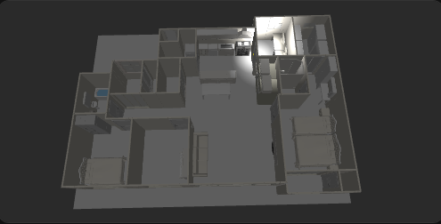

# floor3d-toolkit

> **Sweet Home 3D 도면 → Home Assistant 3D 평면도, 5분 만에.**
> `home.obj` + `home.mtl` + jpeg 텍스처 14개를 텍스처 임베드된 `.glb` 하나로 패키징해서 Home Assistant `floor3d-card`에 그대로 꽂아 쓸 수 있게 해 줍니다.

<p align="center">
  
</p>

[](https://pypi.org/project/floor3d-toolkit/)
[](https://pypi.org/project/floor3d-toolkit/)
[](LICENSE)
[](https://github.com/redchupa/floor3d-toolkit/actions/workflows/test.yml)

---

## 한 줄로

```bash
pip install floor3d-toolkit
floor3d-toolkit pack home.obj -o home.glb
```

→ Home Assistant의 `/config/www/floor3d/`에 `home.glb` 한 파일만 올리면 끝.

---

## 누구를 위한 도구인가요?

✅ Sweet Home 3D로 우리 집 평면도 그려 봤다
✅ Home Assistant `floor3d-card`를 시도해 봤는데 세팅이 너무 복잡해서 포기했다
✅ 클릭 한 번에 거실 조명 ON/OFF, 상태 한눈에 보이는 3D 대시보드를 갖고 싶다

— 이 모든 분께 도움이 됩니다.

---

## 왜 만들었나요?

[floor3d-card](https://github.com/adizanni/floor3d-card)는 멋진 카드인데 **세팅이 진짜 번거롭습니다**:

| 기존 방식 | floor3d-toolkit 사용 |
|---|---|
| Sweet Home 3D에서 `Export to Home Assistant` → `home.obj` + `home.mtl` + jpeg 14개 + `home.json` 우르르 | `pack` 명령 한 번 → `home.glb` 하나 |
| HA의 `/config/www/floor3d/` 폴더에 모든 파일 업로드 | 한 파일만 업로드 |
| GLB 안의 mesh 노드 이름을 찾기 위해 Three.js 인스펙터 또는 Blender 사용 | `--show-light-fixtures`로 시각적으로 확인 |
| 카드 YAML에 24개+ 엔티티 매핑 손으로 작성 | `convert` 모드면 매핑 YAML 자동 생성 |
| 카드가 조명 OFF 상태면 진짜 캄캄해서 평면도 안 보임 | emissive 베이스라인 자동 적용 → 야간에도 식별 |
| `media_player` 엔티티 박으면 카드 크래시 (`Cannot read properties of null (reading 'color')`) | 도메인 인식 `type3d` + 자동 colorcondition으로 차단 |

---

## 5분 워크플로 (제일 추천)

### 📋 준비물

- Python 3.11+
- Sweet Home 3D ([무료, GPL OSS](http://www.sweethome3d.com/))
- Home Assistant + [HACS](https://hacs.xyz) (floor3d-card 설치용)

### 단계 1 — 도면 그리기

Sweet Home 3D 실행, 본인 집 도면 그리기. 단순한 사각형 평면도여도 OK.

**핵심**: 각 방마다 천장 조명 하나 이상 배치 + 조명 이름을 알아보기 쉽게 (예: `Living Main`, `안방 조명`).

### 단계 2 — Home Assistant로 내보내기

Sweet Home 3D는 별도 ExportToHASS 플러그인이 필요합니다 ([Adizanni 플러그인](https://github.com/adizanni/floor3d-card?tab=readme-ov-file#converting-your-sweet-home-3d-floor-plan)).

- 메뉴 `파일 → 내보내기 → Home Assistant 호환 형식` (또는 영문 `Export to Home Assistant`)
- 출력 폴더 선택 (예: `~/Desktop/myhome_export/`)
- 폴더 안에 다음 생성됨:
  ```
  home.obj
  home.mtl
  home_<여러>.jpeg
  home.json
  ```

### 단계 3 — toolkit으로 GLB 패키징

```bash
pip install floor3d-toolkit
cd ~/Desktop/myhome_export
floor3d-toolkit pack home.obj -o dist/home.glb
```

→ `dist/home.glb` 한 파일에 텍스처 14개 임베드 (보통 9~12MB). 1초 만에 완료.

### 단계 4 — Home Assistant에 업로드

HA의 `/config/www/floor3d/` 디렉터리에 `home.glb`만 복사.
방법은 편한 것:
- Samba addon
- File editor addon
- SCP/SSH

### 단계 5 — floor3d-card 추가

HACS → Frontend → `floor3d-card` 검색 + 설치.

대시보드 편집 → 카드 추가 → 수동 → 다음 YAML 붙여넣기:

```yaml
type: custom:floor3d-card
path: /local/floor3d/
objfile: home.glb
shadow: 'yes'
extralightmode: 'yes'
globalLightPower: 0.25
entities:
  - entity: light.living_room_main
    type3d: light
    object_id: light_living_main_light   # GLB 안의 mesh 노드 이름
    action: more-info
    light:
      lumens: 1000
      color: '#ffffff'
      distance: 400
      shadow: 'yes'
      vertical_alignment: bottom
  # ... 본인 조명 추가
```

저장 → 3D 평면도가 떠야 합니다. 클릭하면 조명 토글, ON/OFF 상태가 실시간 반영. 🎉

> **`object_id` 어떻게 알아내요?** 단계 3에서 `--show-light-fixtures` 옵션 켜면 GLB에 작은 박스가 보여서 라이트 위치 한눈에 파악 가능. 매핑 다 한 후엔 옵션 빼고 다시 pack.

---

## 진짜 빈 손에서 시작하고 싶다면 (`convert` 모드)

Sweet Home 3D의 `Export to Home Assistant` 플러그인이 없거나 텍스처 따위 신경 안 쓰고 빨리 프로토타입만 보고 싶을 때:

```bash
floor3d-toolkit convert myhome.sh3d --output dist/ --name home
```

생성되는 파일:

```
dist/
├── home.glb                        # floor3d-card에 바로 꽂는 3D 모델
├── home.obj / home.mtl             # 디버깅용
├── home.entity-mapping.yaml        # mesh ↔ HA 엔티티 매핑 (편집 대상)
└── home.card-config.yaml           # Lovelace에 그대로 붙여넣는 카드 설정
```

매핑 YAML을 본인 HA 엔티티 ID로 채워서 재실행하면 카드 YAML에 자동 반영:

```bash
floor3d-toolkit convert myhome.sh3d \
  --output dist/ \
  --name home \
  --mapping dist/home.entity-mapping.yaml
```

### `convert` 옵션

| 옵션 | 설명 |
|---|---|
| `--mapping <path>` | 사용자 매핑 YAML (mesh ↔ entity_id) |
| `--camera <preset>` | `iso` (기본) / `iso-far` / `iso-close` / `top` / `side` |
| `--light-preset <name>` | `warm` (기본) / `warm-bright` / `cool` / `daylight` / `subtle` |
| `--skip-furniture-meshes` | 가구를 박스로만 처리 (속도/용량 우선) |

---

## 자주 묻는 질문 (Troubleshooting)

### Q. 카드가 안 뜨고 "Finished with errors" 만 보여요

브라우저 콘솔(F12) 열어서 에러 메시지 확인. 가장 흔한 원인:
- **`Entity not found`**: 카드 YAML의 entity_id가 HA에 실제 존재하지 않음. → 매핑 YAML에서 해당 줄 `null`로
- **`Cannot read properties of null (reading 'color')`**: `media_player`나 `sensor` 같은 비표준 도메인을 `type3d: color`로 박았을 때. → toolkit이 자동 처리하니 toolkit 출력 그대로 쓰면 발생 X

### Q. 좌표축만 보이고 모델이 안 보여요

`camera_position` / `camera_target`이 잘못 설정됐거나 너무 멀리. toolkit `convert` 모드는 자동 산출하지만 `pack` 모드는 카드 YAML에서 수동 지정 필요. 기본 `floor3d-card`가 자동으로 모델을 프레임 안에 잡아주는 동작 있어요 — 카메라 옵션 다 빼고 재시도.

### Q. 모든 조명을 켰는데 화이트아웃 (너무 밝아요)

per-light `lumens`가 너무 강함. 500 이하로 낮추세요. 추천 시작값:
```yaml
light:
  lumens: 800
  color: '#ffffff'
  distance: 400
```

### Q. 조명 OFF 상태에서 너무 캄캄해요

`globalLightPower`을 0.4~0.6으로 올리세요. 또는 toolkit으로 다시 pack:
```bash
floor3d-toolkit pack home.obj -o home.glb
# emissive_factor 기본 0.18 적용 — 모든 메시가 자체 발광
```

### Q. 라이트 위치 박스가 보여요 (작은 흰 점들)

`pack` 시 `--show-light-fixtures` 옵션 켜져 있는 상태. 기본은 투명 처리.
```bash
floor3d-toolkit pack home.obj -o home.glb     # 투명 (기본)
floor3d-toolkit pack home.obj -o home.glb --show-light-fixtures   # 표시
```

### Q. 가구 클릭 시 popup 안 떠요

엔티티 매핑이 안 되어 있는 노드는 클릭 비활성. 매핑 YAML에 `furn_<이름>: switch.<entity_id>` 추가 후 재실행.

---

## 보안 / 프라이버시

- 변환은 **100% 로컬**에서만 수행. 본인 도면 데이터가 외부 서버로 전송되는 일 없음.
- 생성된 `.glb`/`.yaml`은 본인 집 구조를 담고 있음 → **공개 레포에 절대 커밋하지 마세요**. `.gitignore`가 `*.sh3d`, `*.obj`, `*.mtl`, `*.glb`, `myhome*` 패턴을 기본 차단합니다.
- `scripts/check_secrets.py` 가 사설 IP / API 키 / 가족 실명 등을 패턴으로 차단 (선택 사용).

---

## 개발 / 기여

```bash
git clone https://github.com/redchupa/floor3d-toolkit
cd floor3d-toolkit
pip install -e ".[dev]"
pytest          # 20 passed
ruff check .
```

이슈/PR 환영합니다: https://github.com/redchupa/floor3d-toolkit/issues

---

## 후원 💝

이 패키지가 도움이 되었다면 따뜻한 커피 한 잔 부탁드립니다.

<p align="center">
  <a href="https://toss.me/redchupa">
    
  </a>
  &nbsp;&nbsp;
  <a href="https://www.paypal.com/paypalme/redchupa">
    
  </a>
</p>

- **토스**: `1000-1261-7813` (우*만)
- *"커피 한잔은 사랑입니다"* ☕

---

## License

[MIT](LICENSE)

---

<details>
<summary><b>English summary</b></summary>

**floor3d-toolkit** packages Sweet Home 3D's `Export to Home Assistant` output
(`home.obj` + `home.mtl` + 14 jpeg textures) into a single texture-embedded
`.glb` that drops straight into Home Assistant's `floor3d-card`.

```bash
pip install floor3d-toolkit
floor3d-toolkit pack home.obj -o home.glb
```

- One file replaces 15+ scattered assets in `/config/www/floor3d/`.
- Light fixtures hidden by default for a clean look;
  `--show-light-fixtures` reveals them while you wire up
  `entity-mapping.yaml`.
- Emissive baseline keeps the floor plan readable even when all HA lights
  are off.
- Domain-aware `type3d` selection prevents floor3d-card crashes on
  `media_player` / `sensor` entities.
- Includes a `convert` command that goes straight from `.sh3d` → glb +
  entity-mapping.yaml + card-config.yaml.

MIT-licensed. Free OSS dependencies only (`trimesh`, `pygltflib`, `lxml`,
`pyyaml`, `unidecode`, `networkx`, `scipy`).

See [docs/tutorial-en.md](docs/tutorial-en.md) for the full walkthrough.

</details>
